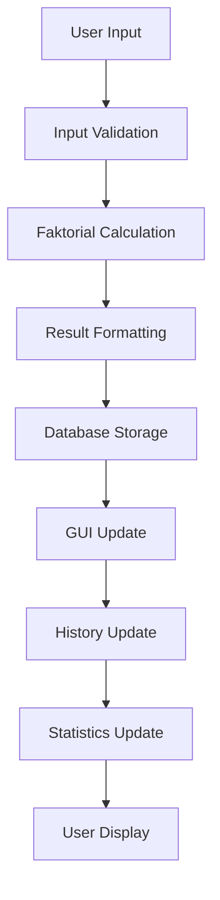
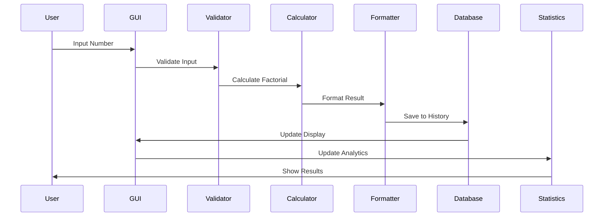

# 🧮 Kalkulator Faktorial

<div align="center">


**Aplikasi kalkulator faktorial canggih dengan GUI modern, database history, dan fitur lengkap**

[Fitur](#-fitur) • [Instalasi](#-instalasi) • [Penggunaan](#-penggunaan) • [Dokumentasi](#-dokumentasi) 

</div>

## 📋 Daftar Isi

- [Gambaran Umum](#-gambaran-umum)
- [Fitur](#-fitur)
- [Instalasi](#-instalasi)
- [Penggunaan](#-penggunaan)
- [Dokumentasi](#-dokumentasi)
- [Contoh Penggunaan](#-contoh-penggunaan)
- [FAQ](#-faq)

## 🚀 Gambaran Umum

**Kalkulator Faktorial** adalah aplikasi kalkulator faktorial modern yang tidak hanya menghitung hasil, tetapi juga memberikan penjabaran lengkap, menyimpan riwayat perhitungan, dan menyajikan statistik penggunaan. Dibangun dengan Python dan Tkinter, aplikasi ini menawarkan pengalaman pengguna yang intuitif dan powerful.

### ✨ Highlights

- 🎨 **GUI Modern** dengan dark theme yang eye-friendly
- 💾 **Database SQLite** untuk penyimpanan history otomatis
- 📊 **Statistik Real-time** penggunaan aplikasi
- 🧮 **Penjabaran Lengkap** proses perhitungan faktorial
- 🚀 **Multi-tab Interface** untuk organisasi yang rapi
- ⚡ **Performance Optimized** untuk angka besar

## 🌟 Fitur

### 🧮 Core Calculator
- **Perhitungan Faktorial** - Menghitung n! dengan akurat
- **Penjabaran Visual** - Menampilkan langkah demi langkah perhitungan
- **Format Angka Besar** - Otomatis memformat angka sangat besar
- **Validasi Input** - Memastikan input valid dan aman

### 💾 Data Management
- **Auto-save History** - Setiap perhitungan langsung tersimpan
- **SQLite Database** - Penyimpanan terstruktur dan efisien
- **Riwayat Lengkap** - Akses semua perhitungan sebelumnya
- **Clear History** - Opsi menghapus riwayat
- **Backup Otomatis** - Data tersimpan secara lokal

### 📊 Analytics & Statistics
- **Total Perhitungan** - Statistik penggunaan aplikasi
- **Angka Tertinggi** - Record angka terbesar yang dihitung
- **Aktivitas Terakhir** - Waktu perhitungan terakhir
- **Trend Analysis** - Pola penggunaan over time

### 🎨 User Experience
- **Dark Theme** - Tema gelap modern mengurangi mata lelah
- **Responsive Design** - Adaptif berbagai ukuran layar
- **Keyboard Shortcuts** - Navigasi cepat dengan keyboard
- **Multi-tab Interface** - Organisasi fitur yang rapi
- **Real-time Updates** - Update otomatis semua panel

### ⚡ Performance
- **Optimized Algorithm** - Perhitungan efisien untuk angka besar
- **Memory Management** - Penggunaan memori yang optimal
- **Error Handling** - Penanganan error yang robust
- **Input Validation** - Validasi ketat untuk keamanan


## 📥 Instalasi

### Prerequisites

- Python 3.6 atau lebih tinggi
- pip (Python package manager)
- SQLite3 (biasanya sudah included dengan Python)

### System Requirements

| Component | Minimum | Recommended |
|-----------|---------|-------------|
| Python | 3.6 | 3.8+ |
| RAM | 512 MB | 1 GB |
| Storage | 10 MB | 50 MB |
| OS | Windows 7+, macOS 10.9+, Linux | Windows 10+, macOS 11+, Ubuntu 18+ |

### Step-by-Step Installation

1. **Download Repository**
   ```bash
   git clone https://github.com/username/super-faktorial-calculator.git
   cd super-faktorial-calculator
   ```

2. **Buat Virtual Environment (Recommended)**
   ```bash
   # Windows
   python -m venv faktorial_env
   faktorial_env\Scripts\activate
   
   # Linux/Mac
   python3 -m venv faktorial_env
   source faktorial_env/bin/activate
   ```

3. **Install Dependencies**
   ```bash
   pip install -r requirements.txt
   ```

4. **Verifikasi Instalasi**
   ```bash
   python main.py
   ```

### Quick Install (Windows)
```bash
# Download zip dan ekstrak
cd super-faktorial-calculator
python main.py
```

## 🎮 Penggunaan

### Menjalankan Aplikasi

```bash
python main.py
```

### Basic Usage Flow

1. **Buka Tab Kalkulator**
   - Masukkan angka non-negatif di field input
   - Tekan `Enter` atau klik "Hitung Faktorial"

2. **Lihat Hasil**
   - Hasil ditampilkan dengan format yang mudah dibaca
   - Penjabaran lengkap proses perhitungan
   - Auto-save ke database

3. **Review History**
   - Buka tab "History" untuk melihat riwayat
   - Sortir berdasarkan waktu atau angka

4. **Analytics**
   - Buka tab "Statistik" untuk melihat usage analytics

### Advanced Features

#### Format Input Khusus
```
5           → 5! = 120
10          → 10! = 3.628.800
50          → 50! = 3.04140932 × 10^64
```

#### Keyboard Shortcuts

| Shortcut | Action |
|----------|--------|
| `Enter` | Hitung faktorial |
| `Ctrl + 1` | Switch ke tab Kalkulator |
| `Ctrl + 2` | Switch ke tab History |
| `Ctrl + 3` | Switch ke tab Statistik |
| `Esc` | Clear input |

## 📚 Dokumentasi

### System Workflow



### Data Flow



### File Descriptions

| File | Description |
|------|-------------|
| `main.py` | Entry point, menginisialisasi dan menjalankan aplikasi |
| `gui/main_window.py` | Implementasi GUI dengan Tkinter |
| `models/database.py` | Operasi database SQLite untuk history |
| `utils/calculator.py` | Logic perhitungan faktorial dan formatting |


## 💡 Contoh Penggunaan

### Basic Calculation
```
Input: 5
Output: 
🎉 HASIL: 5! = 120
📝 Penjabaran: 5 × 4 × 3 × 2 × 1
```

### Large Number Calculation
```
Input: 50
Output:
🎉 HASIL: 50! = 3.04140932 × 10^64
📝 Penjabaran: 50 × 49 × 48 × ... × 3 × 2 × 1
```

### Error Handling
```
Input: -5
Output: Error: Angka tidak boleh negatif!

Input: abc
Output: Error: Input harus berupa bilangan bulat!

Input: 1001
Output: Konfirmasi: Angka 1001 sangat besar dan mungkin membutuhkan waktu lama. Lanjutkan?
```

## ❓ FAQ

### Q: Apakah perlu install library tambahan?
**A:** Tidak! Aplikasi ini menggunakan pure Python standard library saja (tkinter, sqlite3).

### Q: Berapa angka terbesar yang bisa dihitung?
**A:** Secara teori tidak ada batas, tapi secara praktis dibatasi oleh memory dan performance. Angka di atas 1000! mungkin membutuhkan waktu lama.

### Q: Bagaimana cara backup data history?
**A:** File database `faktorial_history.db` bisa di-copy untuk backup. Format SQLite kompatibel dengan berbagai tools.

### Q: Bisakah diintegrasikan dengan aplikasi lain?
**A:** Ya! Module `FaktorialCalculator` dan `HistoryDatabase` bisa diimport dan digunakan di project lain.

### Q: Apakah support Windows/Mac/Linux?
**A:** Ya! Aplikasi ini cross-platform dan bisa berjalan di semua OS yang support Python.

### Q: Bagaimana cara reset aplikasi?
**A:** Hapus file `faktorial_history.db` dan restart aplikasi.

### Q: Bisakah menghitung faktorial decimal/gamma?
**A:** Saat ini hanya integer non-negatif.

---

<div align="center">

## ⭐ Support Project Ini dengan memberikan bintang

**"Mathematics is the poetry of logical ideas." - Albert Einstein**

[Kembali ke Atas](#-Kalkulator-Faktorial)

</div>